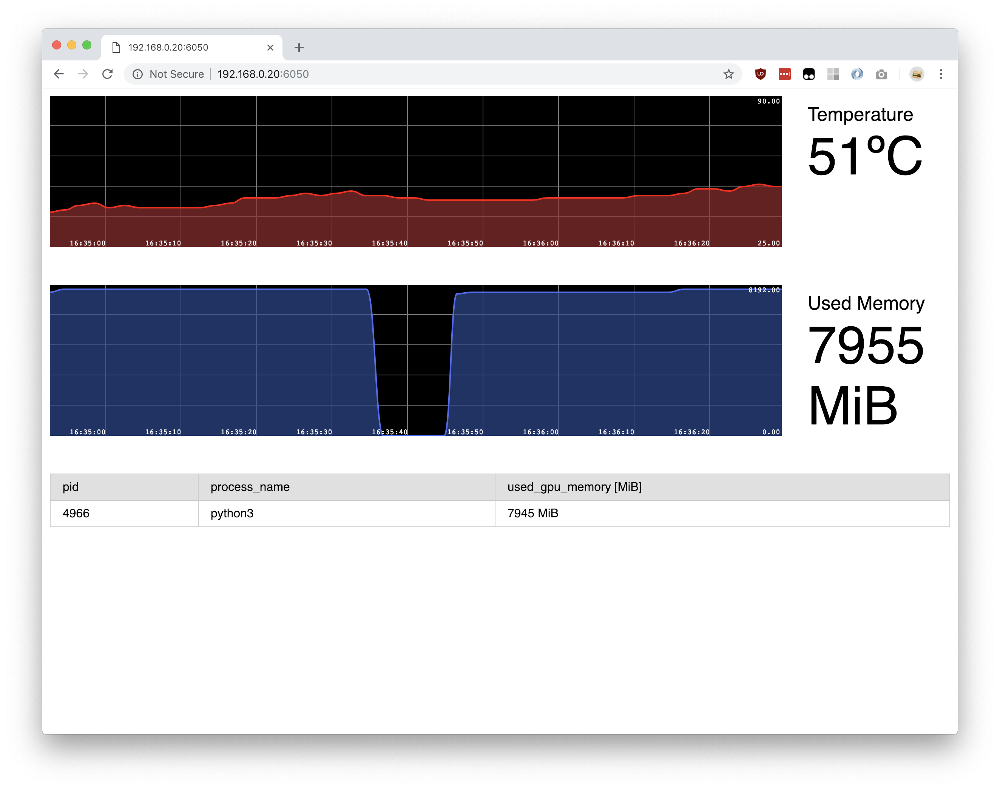

# Nvidia Status Page

A simple `Python-Flask` app that plots information from `nvidia-smi` to http://0.0.0.0:6050.

You must have `nvidia-smi` installed.

I recommend using this as an init `service` script.
